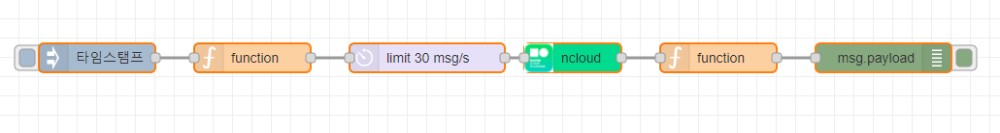
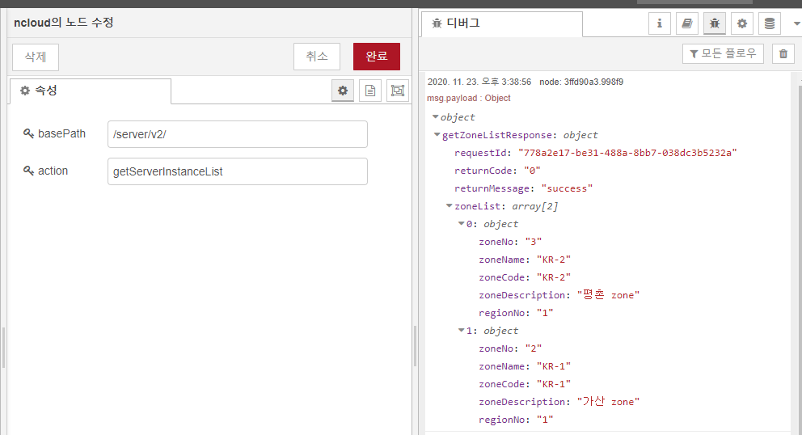

node-red-contrib-ncloud
========================

<a href="http://nodered.org" target="_new">Node-RED</a> 

<a href="https://www.npmjs.com/package/naver-ncloud-apis" target="_new">naver-ncloud-apis wrapper</a>.

Install
-------

Run the following command in the root directory of your Node-RED install:

    npm install node-red-contrib-ncloud --save

## 시작하기

### node-red-contrib-ncloud 를 사용하기 위해서는 먼저 인증키를 생성해야 합니다.

- 인증키는 [포털](https://www.ncloud.com)의 마이페이지 > 계정관리 > [인증키 관리](https://www.ncloud.com/mypage/manage/authkey) 메뉴에서 "신규 API 인증키 생성"을 통해서 Access Key ID, Secret Key 를 생성합니다.
- 이미 생성된 인증키가 있을 경우 [포털](https://www.ncloud.com)의 마이페이지 > 계정관리 > [인증키 관리](https://www.ncloud.com/mypage/manage/authkey) 메뉴에서 확인할 수 있습니다.
- sub account 의 경우, [Console](https://console.ncloud.com)의 [Sub Account](https://console.ncloud.com/iam/dashboard) > Sub Accounts > 서브 계정 상세 메뉴에서 "API Key"탭에서 생성한 Access Key ID, Secret Key 를 사용할 수도 있습니다.

### 생성된 인증키 정보를 저장합니다.

- Mac/Linux 의 경우 ~/.ncloud/configure 에, Windows 의 경우 C:\Users\USERNAME\\.ncloud\configure 에 인증키 정보를 저장합니다.
- configure 파일은 [NCLOUD CLI](http://docs.ncloud.com/ko/tool/tool-3-1.html) 를 이용하여 생성할 수도 있습니다.
- configure example

```
ncloud_access_key_id = xxxxxxxxxxxxx
ncloud_secret_access_key = xxxxxxxxxxxxxxxxxxxxxxxxxxxxx
```

Usage
-----

## ncloud  

<i><a href="https://www.npmjs.com/package/naver-ncloud-apis" target="_new">ncloud</a></i> api request node.


### method 
- GET, POST, PUT, DELETE 

### basePath 
- need basePath , ex) /server/v2/

### action 
- need action, ex) getZoneList, getServerInstanceList .. 

### actionParams 
- need actionParams

## sample flow



- Ctrl+c & Ctrl+v by import function

```json
[{"id":"4938cb4e.76a934","type":"ncloud","z":"a796e9dc.51d198","basePath":"/server/v2/","action":"getZoneList","x":610,"y":80,"wires":[["b26d373c.ac7f98"]]},{"id":"a91b562d.b11578","type":"inject","z":"a796e9dc.51d198","name":"","props":[{"p":"payload"},{"p":"topic","vt":"str"}],"repeat":"","crontab":"","once":false,"onceDelay":0.1,"topic":"","payload":"","payloadType":"date","x":120,"y":80,"wires":[["13bfc7d8.7c7878"]]},{"id":"3ffd90a3.998f9","type":"debug","z":"a796e9dc.51d198","name":"","active":true,"tosidebar":true,"console":false,"tostatus":false,"complete":"false","statusVal":"","statusType":"auto","x":930,"y":80,"wires":[]},{"id":"13bfc7d8.7c7878","type":"function","z":"a796e9dc.51d198","name":"","func":"msg.method = 'GET';\nmsg.basePath = '/server/v2/';\nmsg.action = 'getZoneList';\nreturn msg;","outputs":1,"noerr":0,"initialize":"","finalize":"","x":280,"y":80,"wires":[["8eda0a6b.e3b618"]]},{"id":"b26d373c.ac7f98","type":"function","z":"a796e9dc.51d198","name":"","func":"\nreturn msg;","outputs":1,"noerr":0,"initialize":"","finalize":"","x":760,"y":80,"wires":[["3ffd90a3.998f9"]]},{"id":"8eda0a6b.e3b618","type":"delay","z":"a796e9dc.51d198","name":"","pauseType":"rate","timeout":"5","timeoutUnits":"seconds","rate":"30","nbRateUnits":"1","rateUnits":"second","randomFirst":"1","randomLast":"5","randomUnits":"seconds","drop":false,"x":460,"y":80,"wires":[["4938cb4e.76a934"]]}]
```

## result 




```json
{
  "requestId": "778a2e17-be31-488a-8bb7-038dc3b5232b",
  "returnCode": "0",
  "returnMessage": "success",
  "zoneList": [
    {
      "zoneNo": "3",
      "zoneName": "KR-2",
      "zoneCode": "KR-2",
      "zoneDescription": "평촌 zone",
      "regionNo": "1"
    },
    {
      "zoneNo": "2",
      "zoneName": "KR-1",
      "zoneCode": "KR-1",
      "zoneDescription": "가산 zone",
      "regionNo": "1"
    }
  ]
}
```
